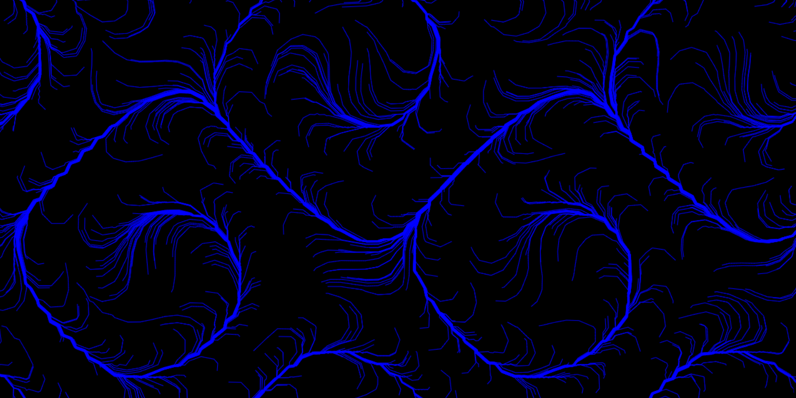
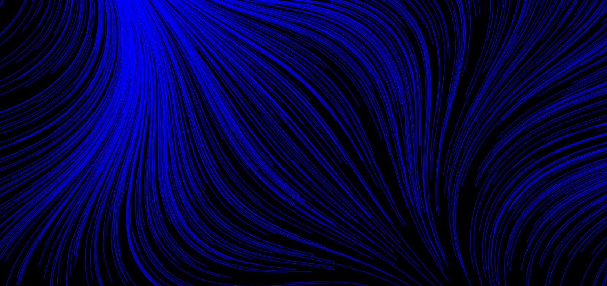

# Creative Code Projects

Welcome to the Creative Code Playground! This repository showcases various creative coding projects, including Flowfield, Perlin Flowfield, and Dotfield simulations. These projects are perfect for exploring generative art, algorithmic design, and interactive visualizations.

## Table of Contents

- [Features](#features)
- [Particle Canvas](#particle-canvas)
- [Particle Motion](#particle-motion)
- [Flowfield Animation](#flowfield-animation)

---
## Features
- Stunning and mesmerizing visual effects.
- Customizable settings and parameters.
- Real-time interaction and animation.
- Export and save your creations.
- Easily integrate these simulations into your own projects.

---
## Particle Canvas

The Particle Canvas project is a simple HTML canvas animation that generates and renders particles on the screen. It's a basic example of creative coding, where particles are randomly distributed on the canvas, creating an interesting visual effect.

---

## Particle Motion

The Particle Motion project is an HTML canvas animation that generates and renders particles with motion trails on the screen. It adds motion and a dynamic element to the basic particle simulation, resulting in a visually engaging experience.

---

## Flowfield Animation

The Flowfield Animation project is an HTML canvas animation that simulates particle motion based on a flowfield. It uses a grid of vectors to guide the movement of particles, creating intriguing patterns and visual effects.

---

Thank you for exploring these creative code projects! 
